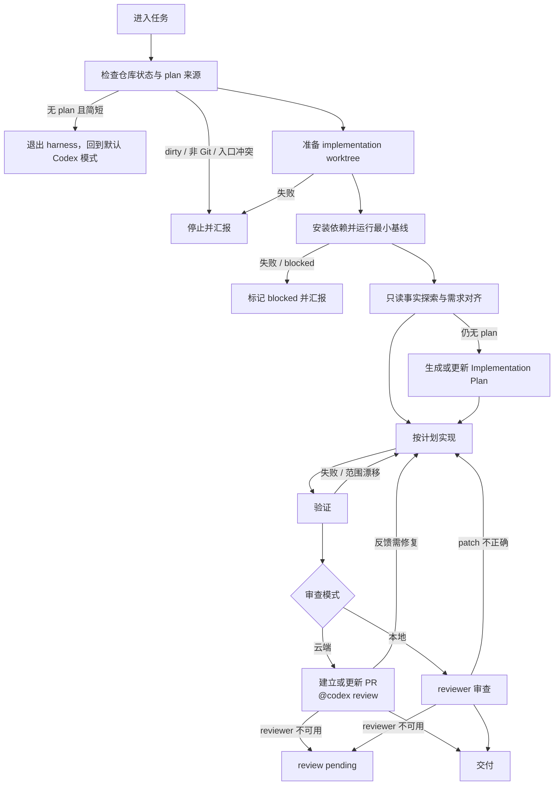

# 中文 Harness 工作流

## 跨平台
该`skill`优先支持ChatGpt(Codex).
如果你不在Codex.请按照以下步骤映射

Claude Code Map:
chatgpt-codex-connector[bot] -> claude[bot]
AGENTS.md -> CLAUDE.md
保持分支使用.worktrees目录分支,而不是`Claude Code`的原生worktree.

其他平台请自行参考相关文档

## 定位

- 可直接接手 `Implementation PR`、`Implementation Plan`，也可接手需要先收敛 plan 的复杂实现任务。
- 无可执行 plan 且任务简短时，终止本 skill，回到默认 Codex 模式。
- 只保留执行当前任务所需的最小可靠步骤。



---

## 硬规则

- Implementation PR 必须带实现 plan。
- 不在 `main` / `master` 上直接实现。
- Research PR 不合并，不在其分支上实现。
- 继续使用 harness 的实现阶段默认使用 `.worktrees/<slug>`。
- 无可执行 plan 且任务简短时，不进入后续 harness 阶段。
- dirty 状态必须先停下汇报；不得默默纳入当前任务。
- 不自动提交、stash、reset、clean 或丢弃文件。
- PR / Plan 是任务边界；不得顺手扩大范围。
- explorer 只读；实现由主智能体完成。
- 没有验证结果和 reviewer 审查结论，不得声称任务完整完成。
- 默认优先云端审查；用户明确要求本地审查时直接走本地审查；否则只有 reviewer 不可用时才从云端回退到本地审查。


# 第一阶段：启动与收敛

目标：用最少步骤确认仓库事实、是否继续使用 harness、隔离目录和基线验证入口。

## 1. 入口判断

- 先检查仓库根、工作区状态、当前分支、现有 worktree，以及是否继续使用 harness。
- 工作区 dirty：停止并汇报文件列表；不 stash、不 commit、不 reset、不 clean。
- plan 来源按顺序检查：
  1. 用户直接给出的 `Implementation Plan`
  2. 当前 `Implementation PR` 引用的 plan
  3. 无 plan
- 有可执行 plan：直接接手并执行，不重新生成 plan。
- 无可执行 plan 且任务简短：终止本 skill，回到默认 Codex 模式；不要进入后续 harness 阶段。
- 简短任务同时满足：
  - 目标清楚；
  - 实现边界清楚；
  - 验收方式清楚；
  - 改动局部且不需要多阶段协调或大范围事实探索。
- 无可执行 plan 且任务不简短：Research PR、Issue、外部分析和直接需求都只作为上下文来源；先做最小需求对齐，再读取当前 skill 的 `refs/writing-plan.md`
- 只有任务边界、目标或验收存在阻塞时才提问；一次性提出最少且必要的问题。
- 非阻塞不确定性写入计划的假设或风险；若未生成计划，则写入交付摘要或 PR 描述。

## 2. Worktree 前置

继续使用 harness 时，唯一策略是 `.worktrees/<slug>`。

当前 cwd 已经是目标 implementation worktree 且工作区干净：继续使用当前目录。

其他情况都新建或接手 implementation worktree：

```bash
mkdir -p .worktrees
grep -qxF '.worktrees/' .gitignore 2>/dev/null || printf '\n.worktrees/\n' >> .gitignore
git worktree add ".worktrees/<slug>" -b "<branch-name>" "<base-ref>"
```

```bash
mkdir -p .worktrees
grep -qxF '.worktrees/' .gitignore 2>/dev/null || printf '\n.worktrees/\n' >> .gitignore
git worktree add ".worktrees/<slug>" "<branch-name>"
```

Research PR、`main` / `master` 或明显不匹配任务的分支，都不直接实现；从目标 base 进入 implementation worktree。

后续命令都以 `.worktrees/<slug>` 为工作目录执行；不要依赖 `cd` 持久化。

`git worktree add` 失败时，先检查目标目录占用、分支占用，以及当前是否已处于正确的 implementation worktree；如果当前目录就是正确 worktree，继续使用当前目录；否则停止并汇报首个可执行冲突。不要自动删除目录、覆盖分支或清理 worktree。

## 3. 依赖安装与基线检查

- 进入目标 implementation worktree 后，按项目事实安装依赖；默认示例是 `pnpm install`。
- 如果 `AGENTS.md`、lockfile 或 README 指定其他命令，以项目事实为准。
- 安装后运行项目指定的最小基线命令；没有明确命令时，先检查 `package.json`、README、CI 或项目 `AGENTS.md`。

失败处理：

- 安装失败：停止并汇报首个可执行错误，不声称完成。
- 基线命令仍不明确：回到第一阶段补充事实，不要凭空编造命令。
- 基线失败：区分新失败、环境问题和既有失败；无法确认时标记 blocked。

## 4. 进度追踪

- 继续使用 harness 的实现任务都使用 `update_plan` 维护会话任务列表。
- `update_plan` 只映射当前 plan 文件中的任务；完成步骤后同步 plan checkbox。
- 不把 `update_plan` 当长期事实来源；长期事实只写入 PR 描述、计划文件、验证结果或审查结果。

## 5. 只读事实探索

优先使用内置 `explorer` 子智能体做只读事实探索。主智能体只做少量低噪声预检，再把明确目标交给 explorer；可并发一至二个。
`explorer` 只负责事实收集和交叉验证，不负责计划或实现。

视情况可以跳过 explorer 的，只限于：

- 用户明确禁止使用子智能体；
- 一行级 trivial 修改；
- dirty 边界尚未处理；
- 当前环境无法调用 explorer。

给 explorer 的请求保持清晰，包含已知背景、目标、非目标，以及需要核实的文件、调用路径、测试入口或缺失事实；不要求固定输出格式。

主智能体收到 explorer 结果后，必须亲自阅读关键文件并自行分析。explorer 的结果只是事实索引，不是计划或实现依据。

## 6. 需求对齐

完成事实探索和关键代码阅读后，把事实收敛为执行边界：目标、范围、非目标、验收标准、阻塞未确认点。
- 结束条件：目标清楚、范围清楚、验收标准清楚、没有阻塞未确认点。
- 如果探索结果推翻了初始理解，先更新需求对齐；必要时向用户确认。完成需求对齐后，确保已有 plan 文件，再进入第二阶段。

---

# 第二阶段：按计划实现

目标：接管已有实现计划，并由主智能体按计划小步实现。

## 1. 接管实现计划

- 输入是 Implementation Plan：先审阅该计划，再执行。
- 输入是带 plan 的 Implementation PR：先读取 PR 描述和引用的计划，再执行。
- 第一阶段刚生成了 plan：回到该计划文件并执行。

## 2. 实现策略

按当前 plan 的测试策略执行。

> plan 明确采用 TDD 时，加载 `tdd` skill 继续任务

## 3. 主智能体实现

实现阶段由主智能体负责。

- 先读取并批判性审阅计划；有阻塞性疑问时，先与用户确认。
- 无阻塞疑问时，创建或更新 `update_plan`，并按计划小步执行。
- 每一步都同步 `update_plan` 与 plan checkbox，并运行该步骤要求的局部验证。
- 完成所有步骤后，汇总实际变更、验证结果和未解决风险；对齐 Implementation Plan 与 Implementation PR 目标，再进入第三阶段。
---

# 第三阶段：任务验证和交付

目标：验证改动、审查 diff、处理反馈并交付清晰结果。

## 1. 验证

从直接受影响的代码单元测试开始，再逐步扩展到相关模块的集成测试。验证命令从项目事实中取得，而不是凭空编造。

常见来源：

- `AGENTS.md`
- `package.json` scripts
- `Makefile`
- README
- CI 配置
- 相关测试文件

汇报格式：

```md
### 验证结果
| 命令 | 结果 | 说明 |
|---|---|---|
| `<command>` | pass / fail / not run | <关键输出或原因> |
```

- 相关测试失败：回到实现阶段，修复后重跑。
- 环境缺依赖：标记 blocked，不声称完成。
- 明显既有失败：给出证据、命令和影响范围。
- 验证命令不确定：回到第一阶段补充事实。
- 验证范围不足：补充最相关的验证，或明确说明未覆盖风险。

成功则进入 Reviewer 审查阶段。

## 2. Reviewer 审查

### 审查模式选择

- 如果`AGENTS.md`中没有确定审查模式和审查者,请告知用户进行确定,并更新.
- 如果支持云端审查, 默认优先云端 PR 审查：仓库支持云端审查，建立或更新 PR 后触发云端审查。
- 用户明确要求本地审查时：读取 `refs/local-review.md` 并调用 `reviewer` 子智能体。
- 仓库不支持云端审查：回退到本地 `reviewer` 子智能体。

### 通用审查规则

- reviewer 不可用时，Review Gate 未完成；不要以内联自审替代。
- reviewer 判断 patch 不正确时，回到第二阶段修复，然后重新验证和审查。

### 云端 PR 审查

#### 触发云端审查

- 建立或更新 PR 后，按项目要求使用 `.github/pr-review-comment.md` 的评论格式发起云端审查。
- 默认必须带有 `@codex review`；不要自行改写触发格式。

#### 等待云端审查返回

发送 `@codex review` 后，立即等待这轮审查返回。

优先使用：

```bash
node <skill-root>/scripts/review-wait.mjs <owner/repo#pr>
```

例如：

```bash
node <skill-root>/scripts/review-wait.mjs DoraemonHugU/oh-my-harness#2
```

约束：

- 默认同步等待阻塞；如果你还有其他工作，则选择异步执行。
- 关注这些信号：`👀 reaction`、`issue comment`、`PR review`、`inline review comments`。
- `👀 reaction` 只表示触发已被接收，不表示审查已经完成。
- 如果中途又重新发送了 `@codex review`，切到最新一轮继续等待。
- 等到这轮结果后，再处理对应的 `inline review comments`。

#### 处理云端审查结果

- 没有新的 `inline review comments` 时，视为这轮云端审查通过。
- 有新的 `inline review comments` 时，必须加载 `receiving-code-review` skill 处理审查反馈。
- 如果是 PR 模式，交付前，该 PR 不能有任何未回复的 `inline review`。

## 3. 交付

如有: 完成任务后,更新 实现 pr 的描述(依然引用plan等信息),再进行交付汇报. 其余plan等引用信息保持不变. 

最终交付用结构化 Markdown，汇报事实结果，不输出大段 diff。

```md
## 交付结果

**状态**：done 🎉 / blocked ⛔ / review pending 👀 / implementation complete 🛠️

### 变更摘要
<自然语言描述摘要内容>

### 验证
| 命令 | 结果 | 说明 |
|---|---|---|
| `<command>` | pass / fail / not run | <关键输出或原因> |

### 审查
- Reviewer Gate：passed / failed / pending
- reviewer 结论：
- 已处理的 reviewer 发现：
- 未处理项及原因：

### 后续
- 未解决项：
- 风险或限制：
- 本地和云端仓库状态: 已同步 / 未同步
- 建议下一步：
```

交付规则：

- 验证未运行，就写明未运行原因。
- reviewer 未通过，就不能写 `done`。
- 如果用户只要求实现，可以停在 `implementation complete`，但必须明确验证和审查未完成。
- 不把失败包装成成功。

## 4. 子智能体使用约束

- 默认启用子智能体系统处理只读探索、审查或其他单次无状态工作。
- 在相关子智能体返回前，主智能体不要开始会影响任务边界或实现方向的代码修改。
- 等待子智能体期间，可以继续做只读事实收集，但不要直接开始实现。
- 如果只读任务已完成而相关子智能体仍未返回，可使用 `wait_agent` 长阻塞等待，不要空转。
- 向用户交付前，必须收齐仍相关的子智能体结果；不要带着未收口的子任务结束本轮工作。

## 5. Anti Patterns

- 未经长等待(20分钟)的云端审查,就直接进行了最终回答.
- 在次级线程进行回复评论. 而不是在顶级评论中发送.没有全程保持在顶级线程进行回复和发送.
- 审查评论格式没有按照 `.github/pr-review-comment.md` 要求, 导致无法被正确识别和处理.

---

**Related skills:**
- **`tdd`** - plan 默认采用 TDD ，使用 red-green-refactor 循环继续实现
- **`systematic-debugging`** - 遇到 bug、测试失败或异常行为时，先诊断再修复

**Assets:**
- `<skill-root>` - 当前 harness skill 的实际安装目录；下列路径都相对这个目录理解。
- `scripts/review-wait.mjs` - 等待云端审查返回；调用时使用当前 skill 的实际安装路径，不要假设仓库根目录存在同名脚本。
- `refs/writing-plan.md` - plan 写作约束与结构参考。
- `refs/local-review.md` - 本地审查的补充约束。
- `refs/visual-display.md` - 交付展示与可读性约束。
